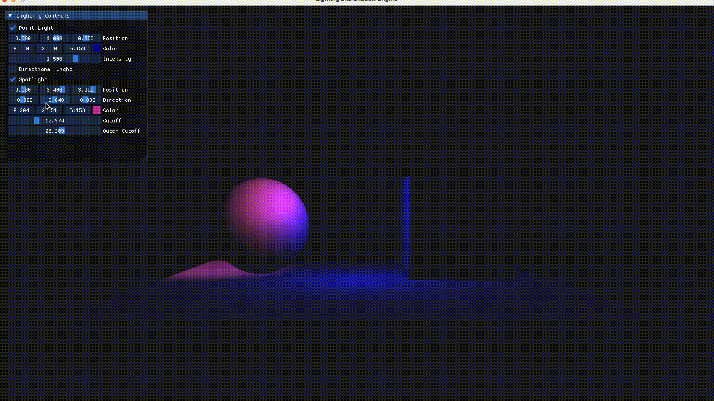

# Real-Time Lighting and Shadows System

This is a real-time 3D rendering system demonstration modern lighting and shadow techniques using OpenGL. It implements multiple lighting types (point, directional, and spotlight), dynamic shadows through shadow mapping, and user-controlled parameters with a real-time UI.

## Features
#### Core Lighting System
-  Multi-light support with Point Lights, Directional Lights, and Spotlights
- Real-time intensity and color controls
- Distance attenuation and spotlight angles

#### Technical
- Interactive UI for user to control lighting intensity, position, direction, and cutoffs
- Modular architecture with component-based lighting system, decoupled UI controls, and shadow pipeline

#### Experimental
- Shadow mapping using depth buffer-based occlusion for all light types
- Percentage-Closer Filtering (PCF)


## Tech Stack

- **Core graphics:** OpenGL 4.1 Core Profile
- **Windowing:** SDL2
- **UI:** Dear ImGui
- **Language:** C++17


## Dependencies

Install dependencies using your preferred package manager!

| Library  | Version  |     License |
| --- | --- | -- |
| [SDL2](https://www.libsdl.org)  | 3.38  | zLib |
| [GLAD](https://glad.dav1d.de)  | 2.0 | MIT|
| [GLM](https://github.com/g-truc/glm) | 0.9.9.8 | MIT | 
| [Dear ImGui](https://github.com/ocornut/imgui) | 1.89.5 | MIT

## Commands


#### Camera Movement
- `WASD` - Move horizontally (forward/left/backward/right)  
- `Spacebar` - Move upward  
- `Left Ctrl` - Move downward  
- `Arrow Keys` - Look around  

#### UI Panel
- Drag sliders to adjust light intensity/color  
- Checkboxes to enable/disable light types  



## Installation and running
**Note** You will need to open build.py to edit configurations to fit your system.
1. Clone the repository:
```bash
  git clone <project-url>
  cd project
  ```
2. Install dependencies
3. Build project
```bash
  python3 build.py
  ```
4. ...and run!
```bash
  ./proj
  ```
    
## Acknowledgements

 - Core concepts and techniques were taught by [Mike Shah](https://www.mshah.io) in CS5310 at Northeastern University - thank you, Professor!
 - [Learn OpenGL](https://learnopengl.com/) 


